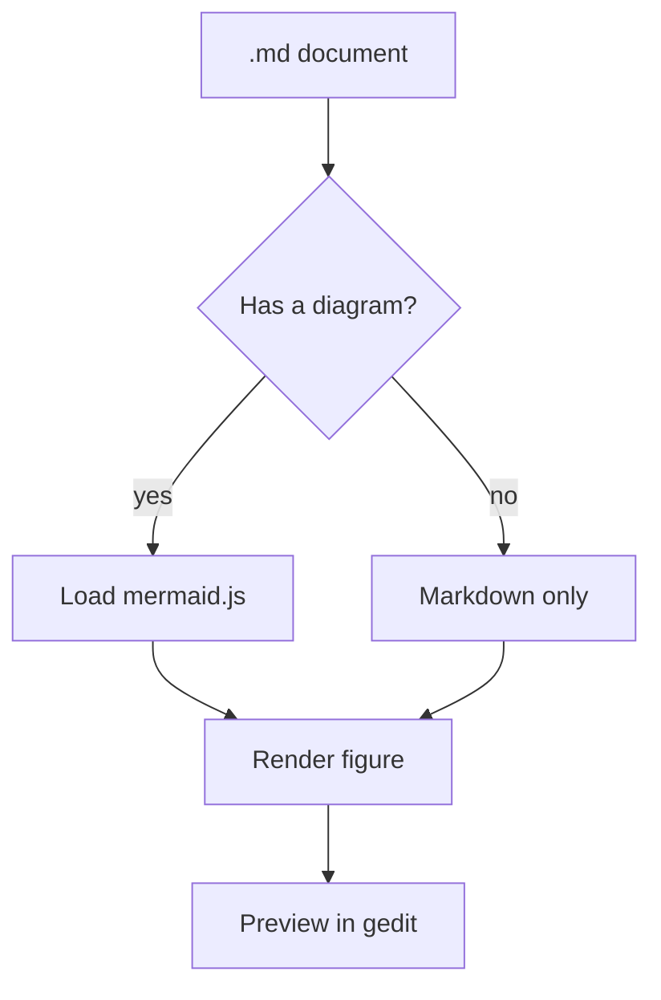
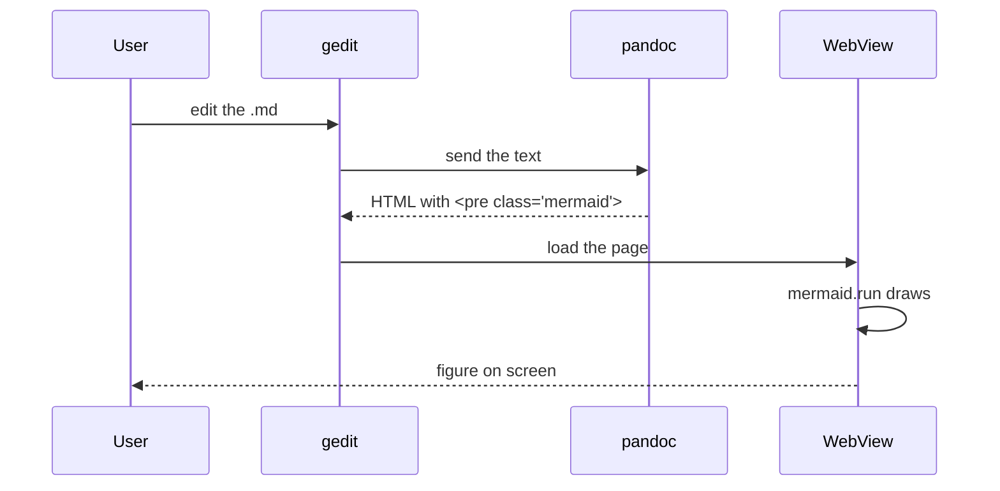
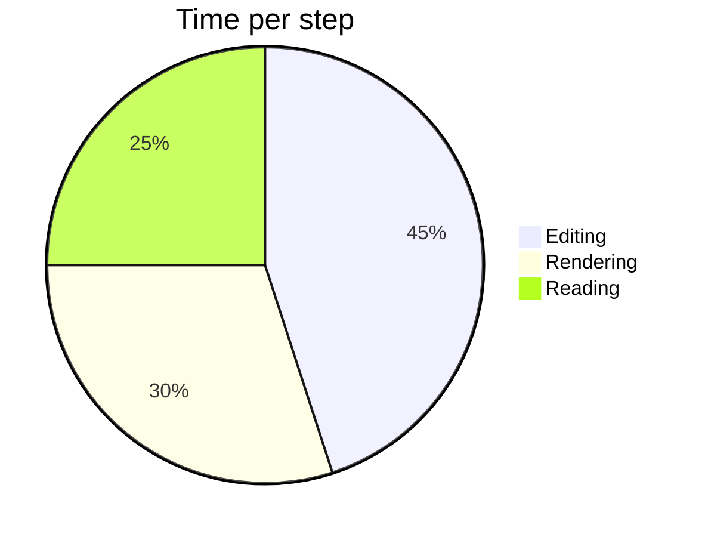

# Mermaid diagram test

A document to check diagram rendering in the gedit preview. The blocks below
should become figures, not raw text.

## Flowchart

## Sequence diagram

## Pie chart

## Living together

The preview mixes everything: a diagram above, math here, $a^2 + b^2 = c^2$, and
a table:

| Kind | Syntax | Renders as |
|---|---|---|
| Markdown | `**x**` | bold |
| Math | `$x^2$` | MathML |
| Mermaid | `mermaid` block | figure |
